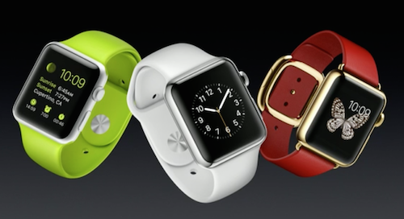
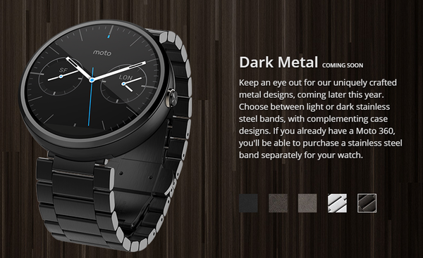
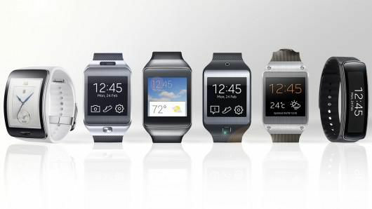
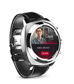
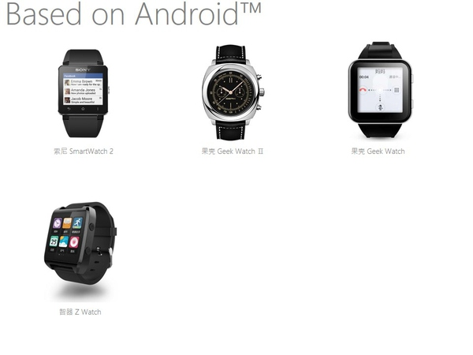
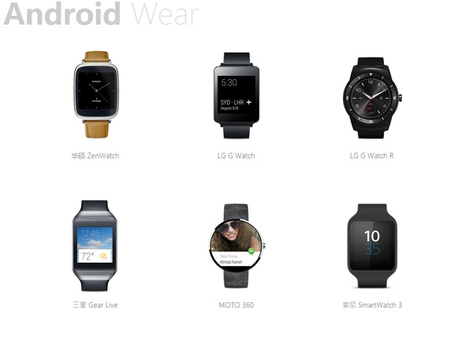
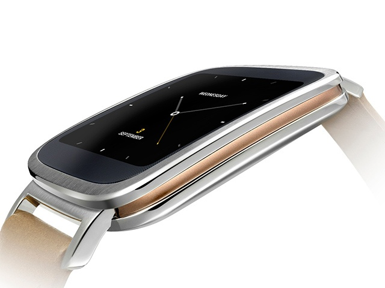

引言
====

智能手表
========

外形
----

**Apple Watch** :

**Moto 360** :

**三星** :

**果壳2代** :

**糖猫** :

#. 搜狗儿童智能手表
#. 语音、定位、游戏。
#. `某宝店铺 <http://detail.tmall.com/item.htm?spm=a230r.1.14.1.qiHh6w&id=42973807143&abbucket=4>`_
#. 同类产品*某零儿童卫士*, *某米手环*

**其它** :

功能
----

#. 装逼必备
#. 外形可媲美传统手表
#. 电话、短信并集成部分应用
#. 无线充电
#. GPS
 

#. 耗电是硬伤
#. 需要配合手机使用

总结
----

据说, `手表在世界范围内已经是一个每年有着600亿美元的产业 <http://www.36kr.com/p/204427.html>`_,
做为智能手表，以后还能和智能手机市场分一杯羹，所以前景有所期待。

目前功能鸡肋，待开发。

